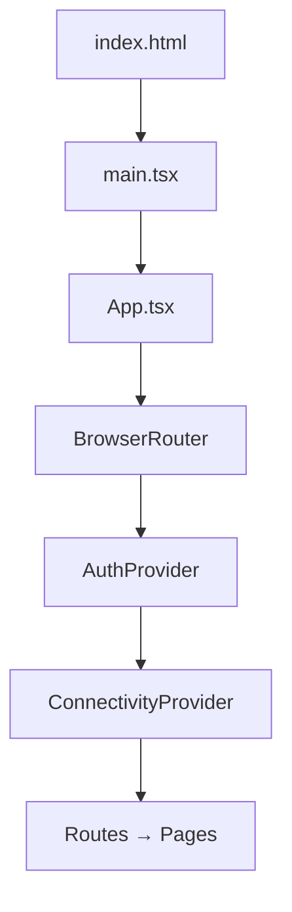
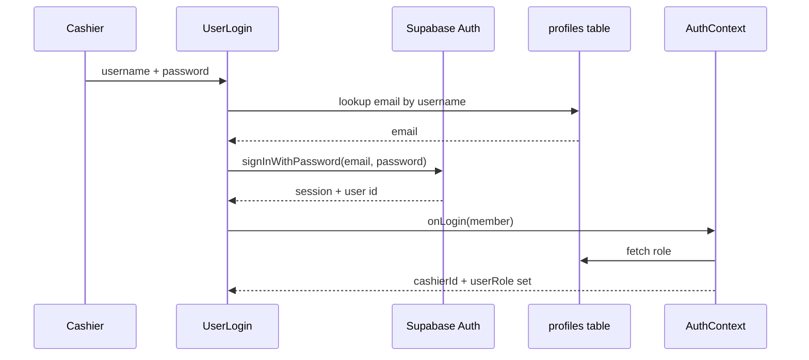
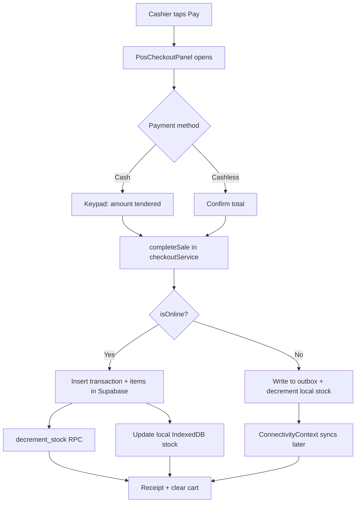
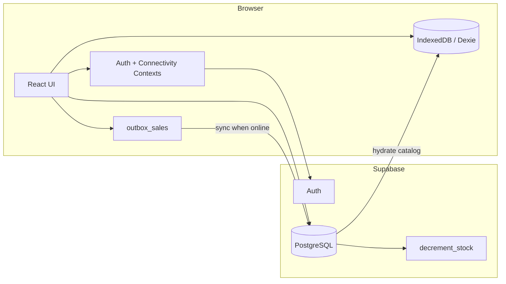

# How This App Is Built — Architecture Guide

This document explains **how the Mini Step POS app works internally**. It is written for learning: if you want to change checkout, offline sync, or auth, start here.

For setup and deployment, see [README.md](../README.md). For day-to-day usage, see [QUICK_START.md](../QUICK_START.md).

---

## 1. What This App Is

A **tablet-first Point of Sale (POS)** for a pet supply store. Cashiers scan or tap products, build a cart, and complete sales. The app:

- Talks to **Supabase** (PostgreSQL + Auth) when online
- Caches the product catalog in **IndexedDB** (via Dexie) for offline use
- Queues offline sales in an **outbox** and syncs them when connectivity returns
- Ships as a **Progressive Web App (PWA)** so it can be installed on tablets

---

## 2. Tech Stack at a Glance

| Layer | Technology | Role |
|-------|------------|------|
| UI | React 18 + TypeScript | Components, pages, local state |
| Routing | React Router 7 | `/`, `/inventory`, `/reports`, `/users` |
| Styling | Tailwind CSS 4 | Utility classes, responsive layout |
| UI primitives | Radix UI + shadcn-style wrappers | Accessible dialogs, buttons, inputs |
| Backend | Supabase JS SDK | Auth, REST queries, RPC (`decrement_stock`) |
| Offline DB | Dexie (IndexedDB) | Product cache + sale outbox |
| Build | Vite 6 | Dev server, production bundle |
| PWA | vite-plugin-pwa + Workbox | Service worker, installable app |
| Charts | Recharts | Reports dashboard |
| Toasts | Sonner | User feedback |
| Tests | Playwright | E2E on iPad viewport |

---

## 3. Application Bootstrap

When the browser loads the app, this is the chain of execution:



### Entry point — `src/main.tsx`

Mounts React into `#root` and imports global CSS. PWA service worker registration is commented out here; Vite PWA handles it in production builds.

### Root shell — `src/app/App.tsx`

Wraps the entire app in two providers, then defines routes:

| Route | Page | Access |
|-------|------|--------|
| `/` | `PosPage` | Everyone (after login) |
| `/inventory` | `InventoryPage` | Admin / manager only |
| `/reports` | `ReportDashboard` | Admin / manager only |
| `/users` | `UsersPage` | Admin / manager only |

`StaffRestrictedRoute` blocks users with role `staff` from non-POS pages and redirects them to `/`.

---

## 4. Global State — Two React Contexts

The app does **not** use Redux or Zustand. Shared state lives in two contexts:

### AuthContext (`src/app/context/AuthContext.tsx`)

Tracks who is logged in:

- `cashierId` — Supabase auth user UUID
- `userRole` — `'admin' | 'staff' | 'manager'` from the `profiles` table
- `authLoading` — true until the initial session is restored

On mount it calls `supabase.auth.getSession()` and subscribes to `onAuthStateChange`. Role is fetched separately from `profiles.role`.

### ConnectivityContext (`src/app/context/ConnectivityContext.tsx`)

Tracks network health and sync status:

- `isOnline` — not just `navigator.onLine`; probes Supabase with a lightweight query
- `pendingSyncCount` / `failedSyncCount` — rows in IndexedDB outbox
- `runSync()` — triggers `syncOutboxSales()`
- Heartbeat every **45 seconds** when the tab is visible

When the device comes back online, pending sales are synced automatically and the user sees toast notifications.

---

## 5. Authentication Flow



**Key detail:** Staff log in with a **username**, not email. `UserLogin` looks up `profiles.email` from `profiles.username`, then calls Supabase Auth with that email.

Role helpers in `src/app/constants/roles.ts`:

- `isStaff(role)` — cashier-only; blocked from inventory/reports/users
- `isAdmin(role)` — can add/edit products on the POS screen

---

## 6. Offline-First Architecture

This is the most important design decision in the app.

### Why offline-first?

Pet stores may lose Wi‑Fi during peak hours. Sales must never stop. The app:

1. Downloads the full product catalog when online
2. Stores it in IndexedDB
3. On offline checkout, writes the sale to a local **outbox** and decrements local stock
4. When online again, pushes outbox sales to Supabase

### IndexedDB schema — `src/app/offline/db.ts`

Database name: `MiniStepPosOffline`

| Table | Purpose |
|-------|---------|
| `products` | Cached catalog (id, name, category, barcode, stock, …) |
| `categories` | Cached category list |
| `meta` | Key-value store (`lastCatalogSync`, `deviceId`) |
| `outbox_sales` | Pending/failed offline transactions |

### Catalog loading — `src/app/offline/productRepository.ts`

`loadProductsForPos(isOnline)`:

- **Offline:** return IndexedDB products (error if cache is empty)
- **Online:** call `hydrateCatalogFromServer()` → fetch from Supabase → replace local cache

Product grid order is persisted in `localStorage` via `src/app/lib/productOrder.ts` (drag-and-drop reorder).

### Sale outbox — `src/app/offline/types.ts`

Each offline sale is an `OutboxSale`:

```ts
{
  id: string;              // client-generated UUID (also client_sale_id on server)
  status: 'pending' | 'syncing' | 'synced' | 'failed';
  payload: { header, lineItems, cartSnapshot };
  createdAt: string;
  retryCount: number;
  lastError: string | null;
  remoteTransactionId: string | null;
}
```

### Sync engine — `src/app/offline/syncEngine.ts`

`syncOutboxSales()`:

1. Guards against concurrent runs (`syncInFlight` mutex)
2. Loads all `pending` and `failed` outbox rows
3. For each sale:
   - Insert into `transactions` (with `client_sale_id` for idempotency)
   - Insert `transaction_items`
   - Call `decrement_stock` RPC per line item
   - Mark outbox row `synced`
4. Refreshes catalog from server

**Duplicate protection:** If Supabase returns a unique-constraint error on `client_sale_id`, the sale is treated as already synced.

**Stock conflicts:** Failed syncs with stock errors stay in `failed` status for retry or manual review.

---

## 7. Checkout Flow



### `src/app/services/checkoutService.ts`

`completeSale(input)` is the single entry point:

| Step | Online | Offline |
|------|--------|---------|
| Validate stock | Local cache + live Supabase query | Local cache only |
| Persist sale | `transactions` + `transaction_items` | `outbox_sales` table |
| Update stock | RPC + local cache | Local cache only |
| Receipt | `TXN-{timestamp}` | `OFFLINE-{short-uuid}` |

`PosCheckoutPanel` handles UI only (payment method, cash keypad in cents, receipt display). It calls `completeSale` and passes the receipt back to `PosPage`.

---

## 8. Main POS Screen — `PosPage.tsx`

`PosPage` is the orchestrator. It owns:

| State | Purpose |
|-------|---------|
| `products` | Catalog from cache or server |
| `cart` | `CartItem[]` with quantities |
| `transactions` | Recent session sales (from outbox) |
| Modal flags | checkout, scanner, login, add/edit item |

**Layout:** Two-column grid on landscape tablets — product grid left, cart/checkout right. Portrait stacks them with height limits.

**Key handlers:**

- `addToCart` — stock check before incrementing quantity
- `handleBarcodeScan` — online lookup first, then cache fallback
- `completeCheckout` — updates UI after `checkoutService` returns
- `reloadProducts` — re-hydrates catalog after admin adds/edits items

---

## 9. Supabase Data Model (Inferred)

The app expects these Supabase resources:

### Tables / views

| Name | Used for |
|------|----------|
| `profiles` | `username`, `email`, `role`, display name |
| `products` | CRUD, stock updates |
| `products_with_categories` | View joining products + category names |
| `categories` | Category list, product creation |
| `transactions` | Sale headers |
| `transaction_items` | Line items per sale |

### RPC

| Function | Purpose |
|----------|---------|
| `decrement_stock(p_product_id, p_quantity)` | Atomic stock reduction on checkout |

### Auth

Supabase Auth stores sessions. The anon key is used client-side; row-level security (RLS) on the server enforces access.

Environment variables (`.env.local`):

```env
VITE_SUPABASE_URL=https://your-project.supabase.co
VITE_SUPABASE_ANON_KEY=your-anon-key
```

---

## 10. Other Pages

### Inventory (`InventoryPage.tsx`)

Full product management: search, filter, low-stock alerts, add/edit/delete. Requires online connection for writes.

### Reports (`ReportDashboard.tsx` + `useReportData.ts`)

Fetches transactions and line items for a date range. Computes:

- Total sales, transaction count, average order
- COGS, gross profit, margins
- Branch breakdown, top products, payment methods, categories

Date boundaries use `src/lib/reportDateRange.ts` for consistent period filters.

### Users (`UsersPage.tsx`)

Staff and member management (admin).

---

## 11. Component Map (POS-focused)

```
PosPage
├── AppHeader / PosStaffBar     ← role-based header, network badge, logout
├── CategoryTabBar              ← Dog / Cat / Meds filters
├── PetProductGrid              ← product cards, drag reorder, quick-add
├── PetCart                     ← line items, qty controls
├── PosCheckoutPanel            ← payment flow
├── BarcodeScanner              ← camera or manual SKU entry
├── UserLogin                   ← required staff login modal
├── AddItemModal                ← admin: new product
└── UpdateItemModal             ← admin: edit product
```

Shared UI lives in `src/app/components/ui/` — thin wrappers around Radix primitives styled with Tailwind.

---

## 12. PWA Layer

`vite.config.ts` configures `vite-plugin-pwa`:

- `display: 'standalone'` — hides browser chrome when installed
- Workbox caches JS, CSS, HTML, images for offline shell
- `devOptions.enabled: true` — service worker also runs in dev

The PWA caches **static assets**, not live Supabase data. Business data offline support comes from IndexedDB, not the service worker.

---

## 13. Testing

| Suite | Location | Purpose |
|-------|----------|---------|
| E2E | `tests/e2e/*.spec.ts` | Login, checkout, roles, inventory, tablet layout |
| Stress | `tests/stress/stress-harness.mjs` | High-volume scenarios, offline/sync |

E2E tests mock Supabase via `tests/e2e/support/supabaseMock.ts` so CI does not need a live database.

Run:

```bash
npm run test:e2e
npm run test:stress
```

---

## 14. How to Trace a Feature

Use this cheat sheet when reading or changing code:

| I want to… | Start here |
|------------|------------|
| Change login | `UserLogin.tsx` → `AuthContext.tsx` |
| Change who sees which page | `roles.ts`, `StaffRestrictedRoute.tsx`, `App.tsx` |
| Change product display | `PosPage.tsx` → `PetProductGrid.tsx` |
| Change cart behavior | `PosPage.tsx` → `PetCart.tsx` |
| Change payment UI | `PosCheckoutPanel.tsx` |
| Change how sales are saved | `checkoutService.ts` |
| Change offline sync | `syncEngine.ts`, `ConnectivityContext.tsx` |
| Change product cache | `productRepository.ts`, `db.ts` |
| Change reports | `useReportData.ts`, `ReportDashboard.tsx` |
| Change Supabase connection | `src/lib/supabase.ts`, `.env.local` |

---

## 15. Data Flow Summary



---

## 16. Design Conventions

1. **Services** (`src/app/services/`) — async business logic, no JSX
2. **Offline layer** (`src/app/offline/`) — IndexedDB only, no React
3. **Contexts** — cross-cutting session + connectivity state
4. **Pages** — route-level composition and local UI state
5. **Components** — reusable UI; POS-specific ones are not in `ui/`
6. **Types** — `src/app/types/pos.ts` for domain models; `offline/types.ts` for sync payloads

When adding a feature, prefer extending an existing service or repository rather than putting Supabase calls directly in components.

---

## 17. Common Pitfalls

1. **Stock double-decrement** — Online checkout updates Supabase via RPC *and* local cache. Offline only touches local cache until sync runs.
2. **Empty offline catalog** — First visit must be online so `hydrateCatalogFromServer()` can populate IndexedDB.
3. **Staff vs admin** — `isStaff` means restricted; admins and managers get inventory/reports access.
4. **Cents vs pesos** — Cash keypad in `PosCheckoutPanel` works in **cents** internally to avoid floating-point errors.
5. **client_sale_id** — Never reuse UUIDs for outbox sales; they prevent duplicate transactions on flaky networks.

---

Happy learning. The best way to understand the app is to set a breakpoint in `completeSale()` and step through an online checkout, then repeat with the network disabled.
